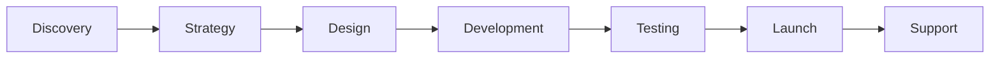

<!-- Logo -->

  

# 🌙 Gloom Studio

> **Crafting Digital Experiences That Leave a Lasting Impression**

Welcome to Gloom Studio - where creativity meets functionality, and every pixel tells a story. We're a passionate team of designers and developers dedicated to transforming your digital vision into reality.

---

## ✨ What We Do

We specialize in creating stunning, high-performance websites and digital solutions that not only look incredible but also drive real business results.

### 🎨 **Design Services**

- **UI/UX Design** - User-centered design that delights and converts
- **Brand Identity** - Complete visual identity systems
- **Responsive Design** - Beautiful experiences across all devices

### 💻 **Development Services**

- **Frontend Development** - Modern, fast, and accessible websites
- **Backend Development** - Robust and scalable applications
- **E-commerce Solutions** - Complete online store experiences
- **API Development** - Seamless integrations and data management

### 🚀 **Digital Solutions**

- **Performance Optimization** - Lightning-fast loading times
- **SEO Optimization** - Get found by your ideal customers
- **Content Management** - Easy-to-use systems for your team
- **Maintenance & Support** - Ongoing care for your digital assets

---

## 🏆 Why Choose Gloom Studio?

| Feature                  | Description                                               |
| ------------------------ | --------------------------------------------------------- |
| **🎯 Results-Driven**    | Every project is built with your business goals in mind   |
| **⚡ Performance-First** | We optimize for speed, accessibility, and user experience |
| **🔒 Security-Focused**  | Your data and your customers' data are always protected   |
| **📱 Mobile-First**      | Responsive design that works perfectly on every device    |
| **🔄 Ongoing Support**   | We're here for you long after launch                      |

---

## 🛠️ Our Tech Stack

### Frontend

### Backend

### Tools & Platforms

---

## 📋 Our Process

1. **🔍 Discovery** - We dive deep to understand your business, goals, and audience
2. **📊 Strategy** - We create a comprehensive plan tailored to your needs
3. **🎨 Design** - We craft beautiful, user-centered designs
4. **💻 Development** - We build robust, scalable solutions
5. **🧪 Testing** - We ensure everything works perfectly
6. **🚀 Launch** - We deploy your project with confidence
7. **🛠️ Support** - We provide ongoing maintenance and support

---

## 📈 Recent Projects

### Sydney Scholars

> **Transforming manual educational reporting into a seamless digital experience**

- **Strategy & UI/UX Design** - Complete platform redesign
- **System Architecture** - Scalable reporting infrastructure
- **Frontend & Backend Development** - Full-stack solution
- **Stakeholder Collaboration** - Tutors, administrators, and parents
- **Real-time Updates** - Instant notifications and approvals

[View Case Study →](https://gloom.studio/projects/sydney-scholars)

### WE-Print

> **Streamlining the user experience for an E-commerce printing company**

- **UI/UX Design** - Intuitive editor experience
- **Frontend & Backend Development** - Custom e-commerce platform
- **E-commerce Integration** - MedusaJS with Stripe payments
- **Performance Optimization** - 75% reduction in user complaints
- **Conversion Focus** - 40% decrease in cart abandonment

[View Case Study →](https://gloom.studio/projects/we-print)

### Wise Matcha

> **Scalable Ordering and Inventory Platform with Smart Queue**

- **Strategy & System Architecture** - Smart queue management system
- **UI/UX Design** - Mobile-first experience design
- **Frontend & Backend Development** - Next.js with Redis
- **Real-time Processing** - Live inventory and order management
- **Admin Dashboard** - Comprehensive operational control

[View Case Study →](https://gloom.studio/projects/wise-matcha)

---

## 📞 Get In Touch

Ready to bring your digital vision to life? Let's start a conversation!

### Contact Information

- **📧 Email:** hello@gloom.studio
- **🌐 Website:** [gloom.studio](https://gloom.studio)
- **📍 Location:** Remote-first, serving clients worldwide

### Social Media

- **LinkedIn:** [Gloom Studio](https://linkedin.com/company/gloom-studio-au)
- **Instagram:** [@gloomstudio](https://instagram.com/gloomstudio.au)

---

## 🚀 Ready to Get Started?

1. **📋 Schedule a Consultation** - Let's discuss your project
2. **💡 Get a Proposal** - We'll create a custom plan for you
3. **🎯 Start Building** - Watch your vision come to life

---

**Let's create something amazing together! ✨**

[Get Started →](mailto:hello@gloom.studio)

---

_Made with ❤️ by the Gloom Studio team_

